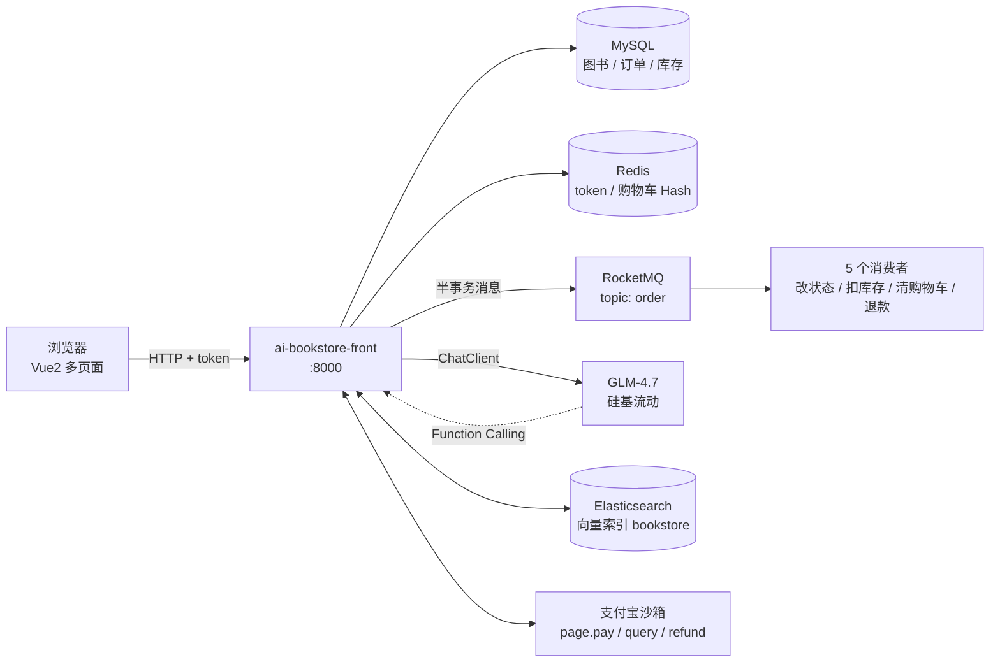
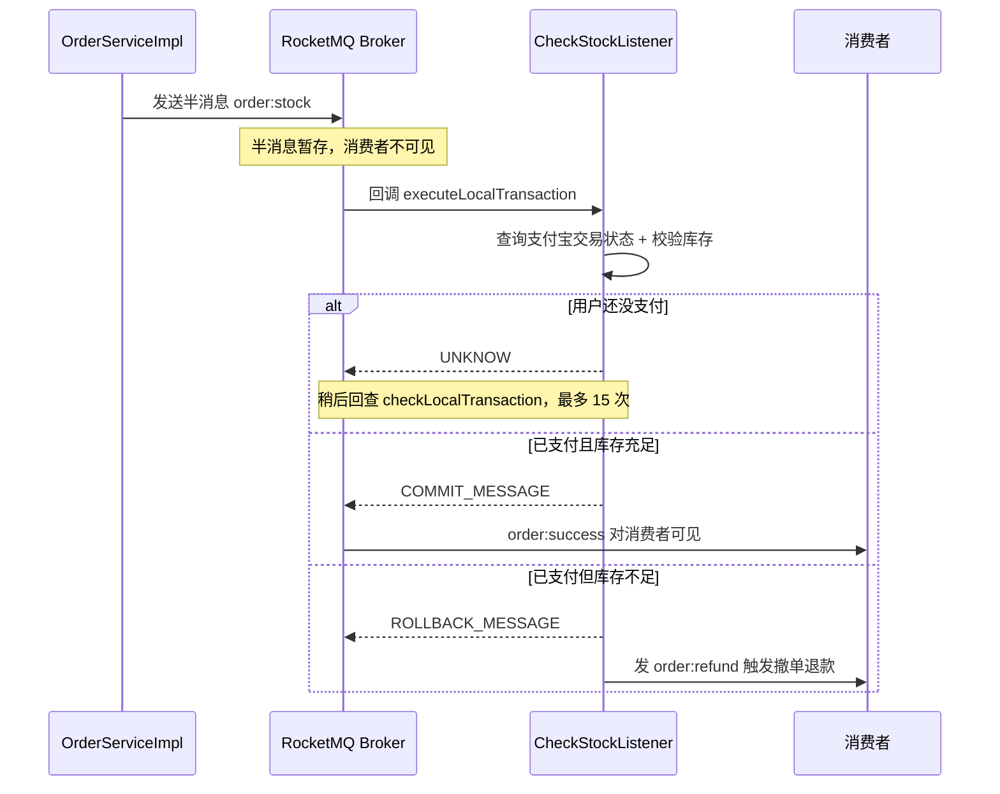

这是[上一篇](/posts/ai-bookstore-showcase/)的技术拆解版。项目整体是个图书电商：注册登录、浏览搜索、购物车、下单、支付宝沙箱支付，AI 层接在交易链路之上。

这篇不讲"用了什么技术"，只讲**遇到了什么问题、为什么这么解、代码长什么样、踩了什么坑**。

## 整体架构



模块拆成 `commons`（实体、Mapper、JWT、工具类）和 `front`（业务模块，唯一可启动）。注意模块名里的 `front` 指的是"面向用户的业务模块"，**它是后端**，不是前端工程。

:::tip
`commons` 改完代码必须重新 `mvn install`，`front` 才会用到新版本——因为是依赖关系。我改完实体没生效，排查了半天才发现是这里。
:::

## 一、Function Calling：让模型真的能动手

### 为什么这件事重要

如果只是"把问题发给模型、把回答显示出来"，那这个功能和贴一个网页版对话框没有区别——模型不知道我购物车里有什么，也没法帮我改。

Function Calling 解决的是**模型主动调用后端函数拿数据、做操作**的问题。

### 定义一个工具

不需要继承任何东西，就是一个普通的 `@Service`，方法上标 `@Tool`：

```java
@Slf4j
@Service
public class ShoppingCartToolServiceImpl implements ShoppingCatToolService {

    public static final String SHOPPING_CART = "shopping_cart:";

    @Tool(description = "根据用户id获取到该用户的所有购物车")
    public List<ShoppingCart> findShoppingCartByUserId(
            @ToolParam(description = "用户的ID") String userId) {
        Map<Object, Object> cartMap = stringRedisTemplate.opsForHash()
                .entries(SHOPPING_CART + userId);
        // 回表补图书信息，组装成 List<ShoppingCart>
    }

    @Tool(description = "根据用户id删除该用户的购物车信息")
    public void clearShoppingCartByUserId(
            @ToolParam(description = "用户的ID") String userId) {
        stringRedisTemplate.delete(SHOPPING_CART + userId);
    }

    @Tool(description = "将选中的图书添加到购物车中")
    public void addShoppingCartByUserId(
            @ToolParam(description = "图书ID") String bookId,
            @ToolParam(description = "用户ID") String userId,
            @ToolParam(description = "加入购物车的数量") int number,
            @ToolParam(description = "创建时间") String createTime) { /* HINCRBY / HSET */ }
}
```

一共四组工具：**身份（who）、购物车、日期、图书全量查询**。注册一次，全局可用：

```java
@Bean("openAiChatClient")
public ChatClient openAiChatClient() {
    return ChatClient.builder(openAiChatModel)
            .defaultTools(whoToolService, shoppingCatToolService,
                          dateToolService, bookToolService)
            .build();
}
```

### 底层发生了什么

```
① 启动时：Spring AI 扫描 @Tool 方法，生成 OpenAI 风格的 function 描述 JSON
          （name + description + parameters schema，@ToolParam.description 变成参数描述）
② 请求时：用户问题 + 工具定义一起发给模型
③ 模型判断需要调用 → 返回 tool_calls（函数名 + 参数 JSON），这不是最终回答
④ Spring AI 反序列化参数 → 反射调用我的 Java 方法
⑤ 函数返回值作为 tool 消息回传模型
⑥ 模型基于真实数据生成最终回复（可能多轮调用）
```

关键在于：**模型全程没有直接访问数据库，它只是"申请调用"，真正执行的是我的 Java 代码。**

### 让模型自己把书名变成 ID

这是我觉得最能说明"工具描述有多重要"的一个接口。用户只说书名，模型得自己先定位到 `bookId`：

```java
@PostMapping(value = "/add2", produces = "text/html;charset=utf-8")
public Flux<String> add2(@RequestParam("question") String question, HttpServletRequest request) {
    String token = request.getHeader("token");
    String prompt = """
            #前置条件
            当前用户的token是{token}，可以根据这个token查找用户信息
            #用户的问题
            {question}
            #注意
            1. 添加购物车时只需要录入图书ID(bookId)、用户ID(userId)和数量(number)
            2. 用户提供了图书的名称，可以根据获取到所有的图书的工具分析到该图书的ID
            3. 如果用户没有提供数量，默认数量为1
            4. 添加购物车之前首先查询这本图书是否在我的购物车中存在，如果存在，则更新购物车的数量
            #提示
            1. 图书的名称只能获取到一个图书ID，如果获取多个或者没有获取到提示失败
            2. 如果正确提示加入购物车成功，如果失败，提示失败原因
            """;
    PromptTemplate promptTemplate = new PromptTemplate(prompt);
    promptTemplate.add("token", token);
    promptTemplate.add("question", question);
    return openAiChatClient.prompt(promptTemplate.create())
            .user(question)
            .stream().content();
}
```

用户输入"帮我把《活着》加两本"，背后是一条这样的链：

```
模型 → findAllBook()                          拿全量图书，定位"活着"的 bookId
     → findShoppingCartByUserId(userId)        判断这本书是否已在购物车
     → updateShoppingCartByUserId(...)  或  addShoppingCartByUserId(...)
     → Redis 真的被改动
     → 返回"已经帮你加好了"
```

### 两条写提示词的经验

1. **结构化提示词**：用 `#前置条件 / #注意 / #提示 / #输出格式` 分段，比一大段自然语言稳定得多。文里那句"图书的名称只能获取到一个图书ID，如果获取多个或者没有获取到提示失败"是踩过坑之后加的——不写清楚，模型会模糊匹配到好几本书然后自己挑一本。

2. **`@Tool` 的 description 是写给模型看的说明书**。模型靠它决定"要不要调、参数填什么"，所以要把"干什么"和"参数是什么"都写清楚。`@ToolParam(description = "用户的ID")` 看着啰嗦，但少这一句模型就可能把参数传反。

:::warning
工具相当于**把后端的操作权限开放给了模型**。`clearShoppingCartByUserId(userId)` 的 `userId` 是模型传进来的参数——模型可能传错，也可能被提示词注入诱导传别人的 ID。

更稳的做法是从 token 解析出当前用户身份，只把它作为工具入参。项目里 `fenxi3` 已经是这么做的（先 `whoToolService.who(token)` 拿 user，再用 `user.getId()`），应该统一。
:::

<!-- TODO 配图 ai-bs-14-tool-call-log.png：服务端日志里的工具调用（tool_calls + 实际执行的方法名）

-->

## 二、RAG：用向量检索做语义搜索

### 关键词搜索解决不了的问题

用户想找的是**感觉**：「适合通勤路上看的、写小人物挣扎的小说」。关键词 `LIKE '%通勤%'` 一条都搜不到——书名里不会有"通勤"这个词。

把图书和问题都变成向量之后，比的是语义距离，真正相关的书才会浮上来。

### 灌库：把书变成向量

```java
List<Book> allBook = bookToolService.findAllBook();
for (Book book : allBook) {
    documents.add(new Document(JSONArray.toJSONString(book)));  // 整本书转 JSON 当一个文档
}
vectorStore.add(documents);   // 内部：文本 → 嵌入模型 → 向量写入 ES
```

配置上只有一条铁律——**维度必须和嵌入模型一致**：

```yaml
spring:
  ai:
    openai:
      embedding:
        options:
          model: "Qwen/Qwen3-Embedding-8B"
          dimensions: 4096
    vectorstore:
      elasticsearch:
        index-name: bookstore
        similarity: cosine
        dimensions: 4096
        initialize-schema: true
```

这个坑上一篇智能客服里也踩过：维度不一致时写入不一定报错得明显，表现出来是"检索结果莫名其妙地差"，很难查。

### 检索

```java
SearchRequest searchRequest = SearchRequest.builder()
        .query(question)            // 问题文本，内部自动转向量
        .topK(10)                   // 返回最相似的 10 条
        .similarityThreshold(0.4)   // 相似度低于 0.4 的直接丢掉
        .build();
List<Document> documents = vectorStore.similaritySearch(searchRequest);
```

`topK` 管数量上限，`similarityThreshold` 管过滤噪声。只设 `topK` 的话，不相关的内容也会被塞进上下文。

<!-- TODO 配图 ai-bs-11-es-index.png：Kibana/Dev Tools 里 bookstore 索引的结构（dense_vector + 4096 维）与文档数

-->

### 同一个需求，三种实现

`search1 / search2 / search3` 是同一个"用 AI 搜书"需求的三个版本，放在一起看很能说明问题：

| 接口 | 数据来源 | 输出处理 | 评价 |
| --- | --- | --- | --- |
| `search1` | 模型读全量图书 | `.call().content()` + 手写正则洗 JSON | 不依赖向量库，但代码最脏 |
| `search2` | ES 向量检索 TopK | `.call().entity(...)` 结构化输出 | RAG + 框架兜底，最推荐 |
| `search3` | ES 向量检索 TopK | 直接反序列化命中的文档 | 快、零幻觉 |

`search1` 里那段"手工洗 JSON"很能说明问题：

```java
private String extractJsonArray(String response) {
    // 去掉模型可能加上的 markdown 代码块标记
    String cleaned = response.replaceAll("```json\\s*", "")
            .replaceAll("```\\s*$", "")
            .replaceAll(" ", "")
            .replaceAll("\n", "")
            .trim();
    int start = cleaned.indexOf('[');
    int end = cleaned.lastIndexOf(']');
    if (start == -1 || end == -1 || start >= end) return "[]";
    return cleaned.substring(start, end + 1);
}
```

即使提示词里明确写了"不要使用 markdown 代码块标记"，模型偶尔还是会加，所以才有了这段兜底。**这就是 `search2` 的 `.entity()` 更好的原因：把格式约束交给框架，解析失败就抛异常，而不是让业务代码去猜。**

而 `search3` 是三者里最"聪明"的：既然灌库时存进去的就是 Book 的 JSON，检索命中后直接反序列化就行，**根本不需要让模型再复述一遍**——又快又不会编造出不存在的书。

### 把购物车喂给向量库做推荐

`fenxi3` 是把"用户身份 → 购物车 → 向量检索 → 生成推荐"串成一条链的接口：

```java
@GetMapping(value = "/fenxi3", produces = "text/html;charset=utf-8")
public Flux<String> fenxi3(HttpServletRequest request) {
    // 1. 我是谁
    String token = request.getHeader("token");
    User user = whoToolService.who(token);

    // 2. 我的购物车里有什么
    List<ShoppingCart> shoppingCarts = shoppingCatToolService.findShoppingCartByUserId(user.getId());
    List<String> cartsBook = new ArrayList<>();
    for (ShoppingCart cart : shoppingCarts) {
        cartsBook.add(cart.getBook().getId());
    }

    // 3. 用购物车构造查询，去向量库捞风格相似的书
    String question = "请根据图书ID为:" + cartsBook + "，获取和它们风格相似的图书";
    List<Document> documents = vectorStore.similaritySearch(SearchRequest.builder()
            .query(question).topK(5).similarityThreshold(0.4).build());

    // 4. 检索为空时的降级：不能让接口直接 500
    if (documents == null || documents.isEmpty()) {
        return openAiChatClient.prompt().user("推荐五本图书").stream().content();
    }

    // 5. 命中的文档拼成上下文
    PromptTemplate promptTemplate = new PromptTemplate("""
            #请根据如下上下文进行回答
            {document}
            #用户问题
            推荐五本图书
            """);
    promptTemplate.add("document", documents.stream()
            .map(Document::getText).collect(Collectors.joining("\n")));
    return openAiChatClient.prompt(promptTemplate.create()).stream().content();
}
```

第 4 步的降级很关键：向量库没结果时退化成"让模型随便推荐五本"，至少接口还能用。

<!-- TODO 配图 ai-bs-15-ai-recommend.png：基于购物车的推荐结果

-->

## 三、流式输出与结构化输出

对话类接口全部走流式，打字机效果来自 Reactor 的 `Flux`：

```java
return openAiChatClient.prompt(promptTemplate.create()).stream().content();
// 返回 Flux<String>，produces = "text/html;charset=utf-8"
```

**什么时候不该用流式？** 需要拿到完整结果再处理的场景。比如 `search2` 要把整段 JSON 解析成对象，就必须用 `.call()` 阻塞到最后。

结构化输出要留意泛型擦除：

```java
List<Book> list = openAiChatClient.prompt(promptTemplate.create())
        .call()
        .entity(new ParameterizedTypeReference<List<Book>>() {});
```

必须用 `ParameterizedTypeReference`，不能写 `List<Book>.class`——后者在运行期拿不到泛型信息，JSON 库不知道怎么反序列化元素类型。

## 四、RocketMQ 事务消息：一笔订单的一致性

### 问题在哪

下单接口要同时干两件事：往 `order` 和 `order_item` 插数据（本地事务），以及发消息通知后续动作去扣库存、改状态、清购物车。

- 先发消息再落库：消息到了但库没落成，消费者处理一张不存在的订单；
- 先落库再发消息：库落了但消息发送失败，扣库存和清购物车全丢了。

**普通消息保证不了"本地事务 + 发消息"的原子性**，所以要用事务消息。

### 半消息流程



### 发送方

```java
@SneakyThrows
@Transactional(rollbackFor = Exception.class)
public String saveOrder(String token) {
    // 1~3. 生成订单 + 订单明细，订单号用雪花 ID
    long orderId = snowFlakeGenerateIdWorker.nextId();
    order.setId(orderId + "");
    orderMapper.insert(order);
    for (Book book : bookList) { /* 插入 order_item */ }

    // 4. 发半事务消息
    MessageBuilder<String> messageBuilder = MessageBuilder
            .withPayload(JSONArray.toJSONString(bookList))
            .setHeader("KEYS", orderId + "," + price);      // 订单号,金额
    rocketMQTemplate.sendMessageInTransaction("order:stock", messageBuilder.build(),
            JSONArray.toJSONString(bookList));              // 第三个参数会传给事务回调

    // 5. 构造支付宝 PC 支付，把收银台 HTML 返回给浏览器
    // ...
}
```

两个细节：消息 KEYS 里塞了"订单号,金额"，因为后续查支付、发退款消息都要用；`@Transactional` 的 `rollbackFor = Exception.class` 不能省，Spring 默认只对 `RuntimeException` 回滚。

### 两个 RocketMQTemplate

| Bean | 生产者类型 | 用途 |
| --- | --- | --- |
| `rocketMQTemplate` | `TransactionMQProducer` + 事务监听器 | 发事务消息 `order:stock` |
| `rocketMQTemplate2` | `DefaultMQProducer` | 在事务回调里发普通消息 `order:success` / `order:refund` |

"发事务消息"和"在事务回调里发普通消息"是两件事，混用一个会打架，所以拆成两个。

### 事务监听器：把"支付成功"当作本地事务成功的标志

这是整个项目里我最喜欢的设计——**本地事务成功的判定条件不是数据库操作成功，而是"用户已经付款了"**：

```java
@Component
public class CheckStockListener implements TransactionListener {

    @Override
    public LocalTransactionState executeLocalTransaction(Message message, Object o) {
        String orderId = message.getKeys().split(",")[0];

        // 1. 查支付宝交易状态
        AlipayTradeQueryRequest queryRequest = new AlipayTradeQueryRequest();
        Alipay alipay = new Alipay();
        alipay.setOut_trade_no(orderId);
        queryRequest.setBizContent(JSONArray.toJSONString(alipay));

        try {
            AlipayTradeQueryResponse response = SpringMVCConfig.alipayClient.execute(queryRequest);
            if (!Objects.equals(response.getTradeStatus(), "TRADE_SUCCESS")) {
                return LocalTransactionState.UNKNOW;      // 还没付，等 Broker 回查
            }
        } catch (AlipayApiException e) {
            return LocalTransactionState.UNKNOW;
        }

        // 2. 逐本校验库存
        List<Book> bookList = JSONArray.parseArray(o.toString(), Book.class);
        for (Book book : bookList) {
            Stock stock = stockMapper.selectOne(
                    new QueryWrapper<Stock>().eq("book_id", book.getId()));
            if (stock.getNumber() < book.getNumber()) {
                rocketMQTemplate2.syncSend("order:refund", message.getKeys());
                return LocalTransactionState.ROLLBACK_MESSAGE;   // 库存不足 → 撤单退款
            }
        }

        rocketMQTemplate2.syncSend("order:success", orderId + "*" + o.toString());
        return LocalTransactionState.COMMIT_MESSAGE;
    }
}
```

三种返回值的含义：

| 返回值 | 含义 |
| --- | --- |
| `COMMIT_MESSAGE` | 本地事务成功，消息对消费者可见 |
| `ROLLBACK_MESSAGE` | 本地事务失败，Broker 丢弃消息 |
| `UNKNOW` | 暂时判断不了，Broker 稍后回查（最多 15 次，间隔 1s 起指数递增） |

### 五个消费者

| 监听器 | 订阅 | 动作 |
| --- | --- | --- |
| `UpdateOrderStateListener` | `order:success` | 订单状态 0 → 1（已支付） |
| `UpdateStockListener` | `order:success` | 按 order_item 逐本扣减库存 |
| `ClearCartListener` | `order:success` | 删除 Redis 购物车 |
| `RefundOrderListener` | `order:refund` | 撤单（逻辑删除订单） |
| `RefundMoneyListener` | `order:refund` | 调支付宝退款接口 |

一条消息要触发三个互不干扰的动作，用的是广播模式和各自的消费组：

```java
@RocketMQMessageListener(consumerGroup = "ab123", topic = "order",
        selectorExpression = "success", messageModel = MessageModel.BROADCASTING)
```

`BROADCASTING` 下每个实例都会收到消息；如果用默认的集群模式，同一个组内会负载均衡，只会有一个实例消费到。

<!-- TODO 配图 ai-bs-12-rocketmq-console.png：RocketMQ 控制台里 order topic 的消息与消费进度

-->

### 这里踩的坑最多

**坑 1：用成员变量在两次回调之间传数据，会串单。**

```java
private Object o;                       // 类成员

public LocalTransactionState executeLocalTransaction(Message message, Object o) {
    this.o = o;                         // 存进去
    // ...
}

public LocalTransactionState checkLocalTransaction(MessageExt messageExt) {
    List<Book> bookList = JSONArray.parseArray(o.toString(), Book.class);  // 读出来
    // ...
}
```

回查的入参 `MessageExt` 本来就带 `getBody()`，完全可以从消息体解析购物车。用成员变量存的话，**多个订单并发时回查可能读到另一单的数据**——典型的线程安全问题。正确的写法是 `JSONArray.parseArray(new String(messageExt.getBody()), Book.class)`。

**坑 2：两次回调发出的消息体格式不一致，而消费者恰恰是直接拿它当订单号用的。**

```java
// executeLocalTransaction 里：body = "订单号*购物车JSON"
rocketMQTemplate2.syncSend("order:success", orderId + "*" + o.toString());

// checkLocalTransaction 里：body = "订单号"
rocketMQTemplate2.syncSend("order:success", orderId);
```

而消费端是这样写的：

```java
public void onMessage(String s) {                  // UpdateOrderStateListener
    UpdateWrapper<Order> wrapper = new UpdateWrapper<>();
    wrapper.eq("id", s);                           // s 是 "订单号*JSON" 时匹配不到任何行
    wrapper.set("status", 1);
    orderMapper.update(wrapper);
}

public void onMessage(String s) {                  // ClearCartListener
    Order order = orderMapper.selectById(s);        // 查不到 → 下一行 getUserId() 空指针
    stringRedisTemplate.delete(ShoppingCartServiceImpl.SHOPPING_CART + order.getUserId());
}
```

也就是说，"首次回调就付成功"这条路径发出去的 `order:success` 带着脏 body，**改订单状态会静默匹配失败、清购物车会空指针**；只有走回查路径时 body 才是干净的订单号。

**消息体的结构一旦定下来，两条发送路径就不能各发各的**——这是这整套实现里我最该收拾的地方。

**坑 3：消费者没有幂等。**

扣库存是 `stock.setNumber(stock.getNumber() - n)`，非幂等，消息一旦重投就会重复扣。应该以订单号为唯一业务键做去重（Redis `setnx` / 去重表 / 状态机）。

**坑 4：大量回查压 Broker。**

支付是异步的，用户没付款时回调只能返回 `UNKNOW`，Broker 就会反复回查。用户磨蹭几分钟，回查就打很多次。更合理的方式是用延迟消息或支付异步通知来驱动。

**坑 5：退款金额格式化传错了类型。**

```java
NumberFormat format = new DecimalFormat("0.00");
String formatNumber = format.format(s.split(",")[1]);   // ⚠️ 传进去的是 String
```

`DecimalFormat.format(Object)` 只接受 `Number`，传 `String` 会抛 `IllegalArgumentException`。正确写法是先 `Double.parseDouble(...)` 再格式化。

这个坑特别隐蔽，因为**退款只有"库存不足"才会触发**，日常根本走不到，所以它能一直躺在代码里不被发现。

## 五、支付宝沙箱支付

三个关键概念：沙箱环境（用沙箱买家账号测试，不产生真实资金）、RSA2 签名（商户私钥签名、支付宝公钥验签）、网页支付（服务端返回一段自动提交表单的 HTML，浏览器展示收银台）。

三段调用分别是：

```java
// ① 生成支付页：返回 HTML，浏览器自动跳收银台
SpringMVCConfig.alipayClient = new DefaultAlipayClient(
        gatewayUrl, appId, privateKey, "json", charset, publicKey, signType);
AlipayTradePagePayRequest alipayRequest = new AlipayTradePagePayRequest();
alipayRequest.setReturnUrl(returnUrl);      // 同步跳转
alipayRequest.setNotifyUrl(notifyUrl);      // 异步通知
alipayRequest.setBizContent(JSONArray.toJSONString(alipay));
return SpringMVCConfig.alipayClient.pageExecute(alipayRequest).getBody();

// ② 查支付状态（事务回调里用）
AlipayTradeQueryResponse response = SpringMVCConfig.alipayClient.execute(queryRequest);

// ③ 退款（库存不足撤单时用）
// AlipayTradeRefundRequest + out_trade_no + refund_amount
```

`returnUrl` 和 `notifyUrl` 的区别值得单独记一下：

| | returnUrl | notifyUrl |
| --- | --- | --- |
| 谁触发 | 用户浏览器跳转 | 支付宝服务器主动 POST |
| 可靠性 | 低（用户可能直接关页面） | 高 |
| 该做什么 | 展示"支付完成" | **验签 + 幂等 + 更新订单** |

:::caution
项目的 `notifyUrl` 配好了，但**没有对应的接收接口**，目前只能靠事务回调里主动查交易状态兜底。要真正落地得补一个 `/alipay/notify`：验签、幂等、更新订单。
:::

**另一个坑：把支付客户端写成了静态字段。**

```java
SpringMVCConfig.alipayClient = new DefaultAlipayClient(...);   // 每次下单都覆盖这个静态字段
```

`saveOrder` 写它，`CheckStockListener` 读它，**并发下单时 A 的 client 会被 B 覆盖**。而 `DefaultAlipayClient` 本身是线程安全的，做成单例 `@Bean` 完全够用，根本没必要每次下单都 `new`。

## 六、JWT + Redis：为什么两个都要

JWT 是无状态的，好处是服务端不用存 session；坏处是**一旦签发就撤不回来**——用户登出、改密码、被封号，旧 token 依然有效直到过期。

所以登录时两条线一起走：

```java
String token = JwtConfig.getJwtToken(one);
stringRedisTemplate.opsForValue().set("front_token" + one.getId(), token, 1, TimeUnit.DAYS);
```

校验时（`IsLoginInterceptor`）四步：取请求头 token → 验签与过期检查 → 从 token 解出 userId 查 Redis → 与请求携带的 token 比对，一致才放行。

于是：**登出** = 删 Redis key，旧 token 立刻失效；**踢下线** = 覆盖 Redis 里的 token；**改密码** = 删 key，所有端失效。

一句话总结分工：**JWT 负责"这张票是不是我发的、有没有被改过"，Redis 负责"这张票现在还作不作数"。**

:::note
JWT 的 payload 只是 Base64 编码，**任何人都能解开看**。签名只保证"没被篡改"，不保证"看不见"，所以不能往里面放密码之类的敏感信息。
:::

## 七、几个小但值得说的设计

**雪花 ID 当订单号。** 64 位结构：1 位符号 + 41 位时间戳 + 5 位数据中心 + 5 位机器 + 12 位序列。相比自增 ID 不暴露业务量、分库分表不冲突；相比 UUID 更短且趋势递增，对 B+ 树索引友好。时钟回拨时项目里的实现是直接抛异常拒绝生成。

**为什么存成 String？** 19 位的长整型超过了 JS 的 `Number.MAX_SAFE_INTEGER`，直接返回给前端会丢精度。

**Redis Hash 当购物车。** `key = shopping_cart:{userId}`、`field = bookId`、`value = 数量`。天然贴合"商品 ID → 数量"的映射，加减是 `HINCRBY`、读全部是 `HGETALL`，比建一张购物车表轻得多。

**逻辑删除。** `logic-delete-field: isDeleted` 配置之后，所有查询自动拼 `WHERE is_deleted = 0`，`deleteById` 变成 `UPDATE ... SET is_deleted = 1`。所以要记住：`RefundOrderListener` 里的 `deleteById` 其实是逻辑删除，不是物理删除。

**统一响应体。** `JsonResult{data, success, message, code}` 贯穿所有接口，前端只需要解析一种结构。

## 踩过的坑与已知问题

按严重程度排一下，也是我接下来要改的清单：

| # | 问题 | 后果 | 改进方向 |
| --- | --- | --- | --- |
| 1 | `alipayClient` 是静态字段 | 并发下单互相覆盖 | 改成 `@Bean` 单例注入 |
| 2 | 事务回调用成员变量传参 | 回查串到别的订单数据 | 从 `messageExt.getBody()` 解析 |
| 3 | 两条路径的 `order:success` body 格式不一致 | 直接拿 body 当订单号的消费者失败/空指针 | 统一 payload 结构 |
| 4 | 消费端无幂等 | 消息重投重复扣库存 | 订单号去重 + 状态机 |
| 5 | `RefundMoneyListener` 用 `DecimalFormat.format(String)` | 退款分支抛异常，退款实际不执行 | 先 `Double.parseDouble` 再格式化 |
| 6 | 回查大量返回 `UNKNOW` | Broker 回查压力大 | 延迟消息 / 支付异步通知驱动 |
| 7 | `notifyUrl` 没有接收接口 | 支付结果只能靠主动查询 | 补 `/alipay/notify`：验签 + 幂等 |
| 8 | MD5 无盐 | 相同密码密文相同，易被彩虹表破 | BCrypt |
| 9 | JWT 密钥硬编码 | 泄露即可伪造 token | 配置中心 / 环境变量 |
| 10 | 登录校验重复两遍（拦截器 + `IsLoginFilter`），`GlobalCorsConfig` 是死代码 | 改登录逻辑容易只改一边 | 二选一保留，删掉注释掉的配置类 |
| 11 | `@Cacheable` 无失效策略 | 数据更新后读到旧值 | `@CacheEvict` + `RedisCacheManager` + TTL |
| 12 | 向量库文档粒度太粗（整本书 JSON） | 检索精度受限 | 分字段构建文档 + 增量同步 |

把这些写出来比只讲"我用了 RocketMQ 事务消息"更有用——至少我知道自己的代码在什么条件下会出问题。

<!-- TODO 配图 ai-bs-13-logs.png（可选）：完整链路的服务端日志（事务回调 → 库存校验 → 消息发送 → 消费者执行）

-->

## 后续计划

- [ ] 统一事务消息的 payload 结构，修掉消费者拿脏 body 当订单号的问题
- [ ] 支付客户端改为单例 Bean，去掉全局可变状态
- [ ] 消费端加幂等（订单号 + Redis 去重）
- [ ] 修掉退款分支的金额格式化，把退款链路手动走通一次
- [ ] 补 `/alipay/notify`：验签 + 幂等 + 更新订单
- [ ] RAG 文档粒度细化：按简介、标签分字段构建，并做增量同步
- [ ] 缓存改用 `RedisCacheManager` 并加 TTL

## 结语

这个项目让我把 Spring AI 的几块能力（`ChatClient`、Tool Calling、结构化输出、`VectorStore`）用了一遍，也第一次认真处理了"外部系统异步确认"这种一致性场景。

三点最实在的体会：

1. **AI 工程不等于调 API**。工具描述怎么写才让模型"想调、调对"，输出格式不稳怎么兜底，检索为空怎么降级——这些细节才是真正的工作量。`search1` 到 `search3` 的演进就很典型：从手写正则洗 JSON，到把格式约束交给框架，再到干脆不让模型复述。
2. **分布式一致性很具体**。半消息、回查、幂等，看文档时觉得懂了，写一遍才发现：回调里一个成员变量就能让并发场景串单，回查返回 `UNKNOW` 能把 Broker 打爆。
3. **能指出自己代码的缺陷，是一种能力**。上面那张表里的每一条，都是复盘时自己找出来的，比被别人问出来好得多。

代码还在继续完善，后面每补一块都会记下来。