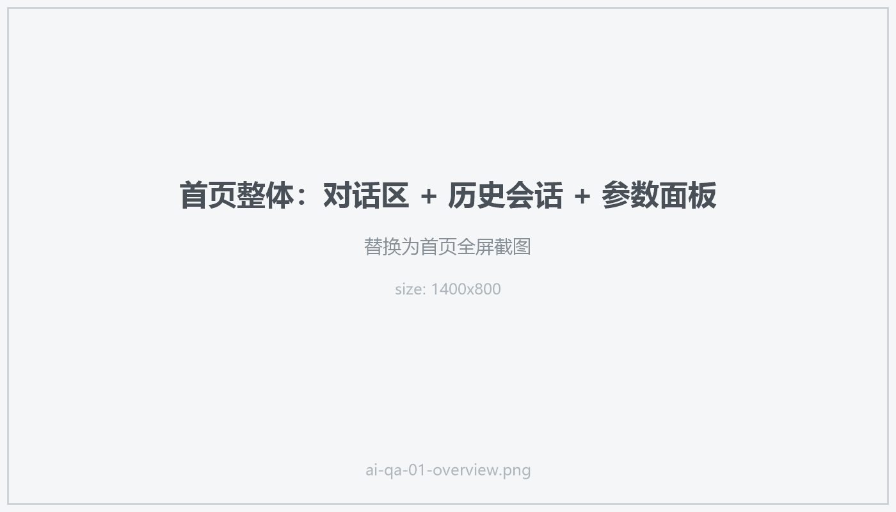
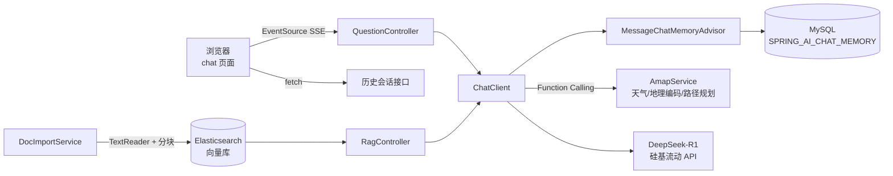
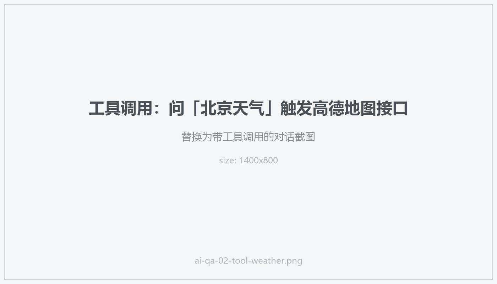
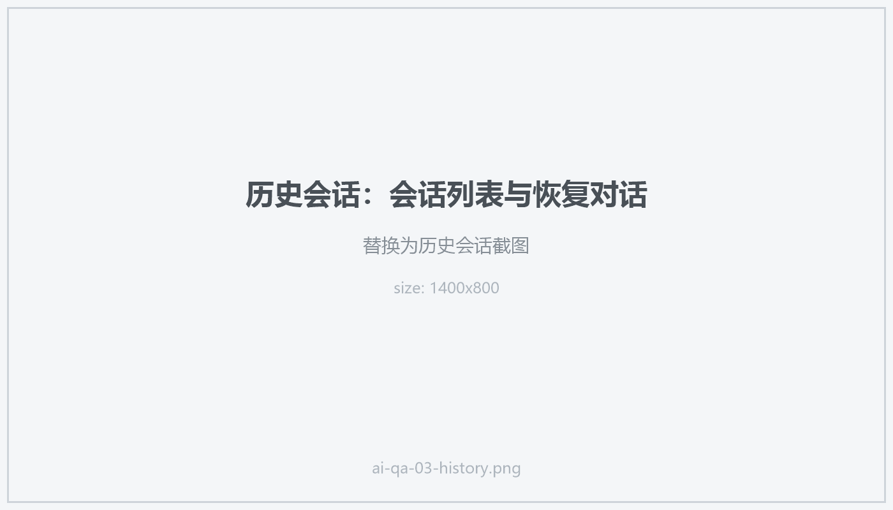
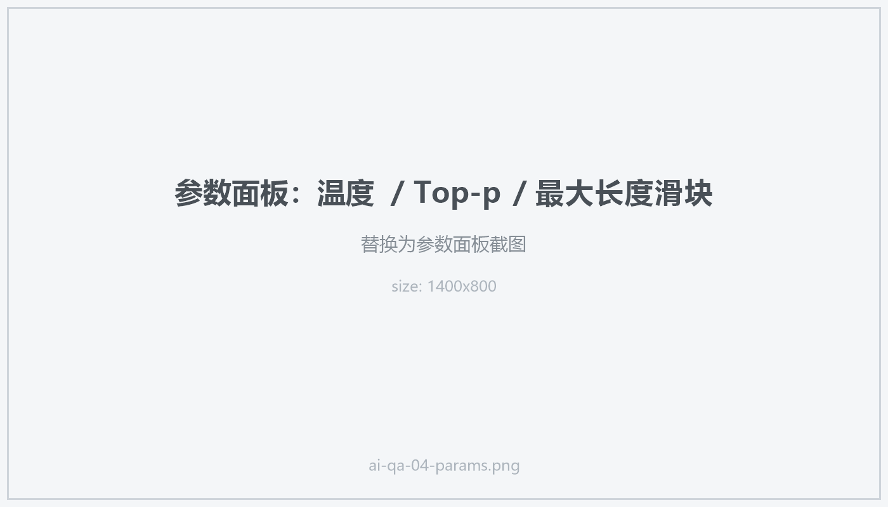

## 为什么写这个项目

大模型 API 谁都会调，但一个"能拿出去用"的 AI 客服，光有 `curl` 是不够的：回答得一个字一个字蹦出来，得记得住上一句聊了什么，得能回答模型自己不知道的私有资料，还得能真的去查一次天气而不是编一个。

这个项目就是把这些都串起来的一次完整实践——**Spring AI + DeepSeek-R1 + Elasticsearch + MySQL**，一个可以独立跑起来的智能客服系统。



## 技术选型

| 层次 | 选型 | 说明 |
| --- | --- | --- |
| 框架 | Spring Boot 3.5.3 / Java 17 | 主框架 |
| AI 编排 | Spring AI 1.0.0 | `ChatClient` + Advisor + Tool |
| 模型服务 | 硅基流动（OpenAI 兼容协议） | `deepseek-ai/DeepSeek-R1` |
| 嵌入模型 | `BAAI/bge-large-zh-v1.5` | 4096 维，中文效果好 |
| 向量库 | Elasticsearch 8.14.1 | 索引 `vectorstore2`，cosine 相似度 |
| 记忆存储 | MySQL | Spring AI 官方的 `JdbcChatMemoryRepository` |
| 前端 | 原生 HTML + Bootstrap 5 + marked.js | 不引入构建工具，改完直接刷新 |

选 Spring AI 而不是自己拼 HTTP 请求，最大的好处是**约定统一**：换模型只改 `application.yml` 里的 `base-url` 和 `model`，代码一行不动——因为硅基流动提供的是 OpenAI 兼容接口，Spring AI 的 `spring-ai-starter-model-openai` 直接就能用。

## 整体架构



下面按链路拆开讲。

## 1. 流式对话：用 SSE，不用 WebSocket

对话接口是 `GET /question/stream`，返回 `text/event-stream`，用 `Flux<String>` 把模型吐出的每个片段推给前端：

```java
@GetMapping(value = "/stream", produces = "text/event-stream;charset=utf-8")
public Flux<String> stream(@RequestParam("question") String question,
                          @RequestParam("id") String id,
                          @RequestParam(value = "temperature", defaultValue = "0.7") double temperature,
                          @RequestParam(value = "topP", defaultValue = "0.9") double topP,
                          @RequestParam(value = "maxTokens", defaultValue = "1000") int maxTokens) {
    return openAiChatClient.prompt()
            .user(question)
            .advisors(e -> {
                e.param("chat_memory_conversation_id", id);   // 会话隔离
                e.param("temperature", String.valueOf(temperature));
                e.param("top_p", String.valueOf(topP));
                e.param("max_tokens", String.valueOf(maxTokens));
            })
            .stream().content()
            .onErrorResume(ex -> Flux.just("发生错误: " + ex.getMessage()));
}
```

前端更简单，`EventSource` 天然就是干这个的：

```js
const eventSource = new EventSource(
  `/question/stream?question=${encodeURIComponent(message)}&id=${sessionId}` +
  `&temperature=${temperature}&topP=${topP}&maxTokens=${maxTokens}`
);
eventSource.onmessage = (e) => { appendToBubble(e.data); };
```

之所以不用 WebSocket：问答是**单向、一问一答**的场景，SSE 基于普通 HTTP，不用额外维护连接状态、不用考虑心跳和重连协议，浏览器还自带断线重连。省下来的复杂度都留给了业务。

顺手做了一件事：`temperature`、`top-p`、`max-tokens` 三个参数由前端滑块实时传进来，调 prompt 的时候不用改代码重启，当场就能看出差别。

## 2. 多轮记忆：把对话存进 MySQL

没有记忆的 AI 客服，每次提问都像第一次见面。Spring AI 提供了 `ChatMemory` 抽象，我用的方案是 **JDBC 持久化 + 消息窗口**：

```java
@Bean("jdbcChatMemory")
public ChatMemory jdbcChatMemory() {
    return MessageWindowChatMemory.builder()
            .chatMemoryRepository(jdbcChatMemoryRepository)   // 官方 JDBC 实现
            .build();
}
```

然后把它作为默认 Advisor 挂在 `ChatClient` 上，这样**每次调用都自动带上下文**，业务代码不用关心：

```java
@Bean("openAiChatClient")
public ChatClient openAiChatClient() {
    return ChatClient.builder(openAiChatModel)
            .defaultAdvisors(MessageChatMemoryAdvisor.builder(jdbcChatMemory).build())
            .defaultTools(amapService)
            .build();
}
```

底层表结构只有四个字段，会话靠 `conversation_id` 隔离——前端每开一个"新会话"就换一个 UUID：

```sql
CREATE TABLE IF NOT EXISTS SPRING_AI_CHAT_MEMORY
(
    conversation_id VARCHAR(36) NOT NULL,
    content         TEXT        NOT NULL,
    type            VARCHAR(10) NOT NULL,
    `timestamp`     TIMESTAMP   NOT NULL,
    CONSTRAINT TYPE_CHECK CHECK (type IN ('USER', 'ASSISTANT', 'SYSTEM', 'TOOL'))
);
```

用 `MessageWindowChatMemory` 而不是全量加载的原因很实际：对话越长 token 越贵，窗口模式只保留最近若干轮，成本可控且不容易超出上下文长度。

## 3. 工具调用：让模型自己去查天气，而不是编一个

这是我觉得最好玩的部分。"北京今天天气怎么样"这种问题，模型训练数据里根本没有——它只能瞎编。解决办法是**把真实 API 注册成工具交给模型**。

高德地图的几个接口用 Spring AI 的注解式声明包装一下：

```java
@Tool(description = "天气查询")
public String weatherAmap(@ToolParam(description = "具体城市名称") String city) {
    String url = "https://restapi.amap.com/v3/weather/weatherInfo?key=" + key + "&city=" + city;
    return restTemplate.getForObject(url, String.class);
}
```

目前一共注册了五个工具：

| 工具 | 作用 |
| --- | --- |
| `weatherAmap` | 查询指定城市的实时天气 |
| `geocode` | 地址 → 经纬度 |
| `regeocode` | 经纬度 → 地址 |
| `directionDriving` | 驾车路线规划 |
| `directionTransit` | 公交路线规划 |

关键在于 `@Tool` 里的 `description`——**那是写给模型看的说明书**，模型据此判断要不要调用、传什么参数。所以描述要写清楚"干什么"和"参数单位/格式"，比如"经纬度，格式：经度,纬度"，少写一句模型就可能把两个参数传反。

因为工具是挂在 `ChatClient` 的 `defaultTools` 上的，一次注册全局可用，流式输出也照样能触发工具调用。



## 4. RAG：把《三体》塞进 Elasticsearch

工具调用解决"实时数据"，RAG 解决"私有知识"。链路分两段：

**入库**——读文本、切块、向量化、写库：

```java
public void importSantiTxt() {
    TextReader txtReader = new TextReader(santiResource);        // classpath:santi.txt
    List<Document> documents = txtReader.get();

    TokenTextSplitter splitter = new TokenTextSplitter();        // 按 token 切块
    List<Document> chunks = splitter.apply(documents);

    vectorStore.add(chunks);                                     // 写入 ES 向量库
}
```

**检索**——用问题去向量库捞相关片段，拼进 prompt 再问模型。ES 那边的配置是：

```yaml
spring:
  ai:
    vectorstore:
      elasticsearch:
        dimensions: 4096              # 要和嵌入模型维度一致
        index-name: vectorstore2
        similarity: cosine
```

这里踩了个不大不小的坑：**向量维度必须和嵌入模型完全一致**。`bge-large-zh-v1.5` 是 4096 维，如果索引建成了 1536 维，写入时不会报错得很明显，是检索结果莫名其妙地差——排查起来很费时间。

另外项目里还引了 PDF、Tika、Markdown 三个 document reader，所以除了纯文本，PDF 和 Markdown 文档也能走同一套导入流程。

## 5. 会话历史与系统状态

除了聊天本身，还做了几个管理接口，让这个系统看起来像个"系统"而不是一个 demo：

| 接口 | 作用 |
| --- | --- |
| `GET /question/history` | 会话列表，取每个会话的第一条用户消息当标题 |
| `GET /question/history/detail?sessionId=` | 某个会话的完整聊天记录 |
| `GET /question/system/status` | 系统状态 + 累计会话数 |
| `GET /import/santi` | 手动触发《三体》文本导入 |
| `POST /api/backup/{database,static,config,full}` | 备份数据库 / 静态资源 / 配置文件 |

会话列表用了一段子查询，取每个 `conversation_id` 里时间最早的那条 `USER` 消息——这样历史列表显示的是"我一开始问了什么"，比显示最后一句更符合直觉：

```sql
SELECT s1.conversation_id, s1.content, s1.timestamp
FROM SPRING_AI_CHAT_MEMORY s1
JOIN (SELECT conversation_id, MIN(timestamp) AS first_time
      FROM SPRING_AI_CHAT_MEMORY WHERE type = 'USER'
      GROUP BY conversation_id) s2
  ON s1.conversation_id = s2.conversation_id AND s1.timestamp = s2.first_time
WHERE s1.type = 'USER'
ORDER BY s1.timestamp DESC;
```



## 前端：一个 HTML 就够了

这个项目的前端没上 Vue/React 工程链，就是一个 `static/index.html`，Bootstrap 5 管样式、`marked.js` 把模型返回的 Markdown 渲染成 HTML、`EventSource` 接流。好处是改一行存一下、浏览器刷新就能看效果，不用等构建。

页面上做了几件实用的事：

- 顶部状态卡：系统状态、累计对话数、平均响应时间
- 右侧历史会话列表 + "新建会话"按钮（新会话 = 新 UUID = 全新上下文）
- 参数面板：温度 / Top-p / 最大长度 三个滑块
- 快捷提问按钮，比如"我想知道北京市的天气"，一键触发工具调用
- 消息可以单条删除，会话内消息数实时统计



## 踩过的坑与已知问题

老实说，这个项目还有不少地方能改，记下来免得下次再犯：

1. **RAG 的问答闭环还没完全打通**。文档导入、向量库写入都已经验证成功，但受嵌入模型的调用额度限制，`/rag` 接口目前返回的是预设回答，真正的"检索 + 拼 prompt + 生成"还需要补上。
2. **密钥硬编码在 `application.yml` 里**。API Key、ES 密码、数据库密码都写在配置文件里了，正确做法是全部走环境变量（高德 Key 已经这么做了），避免哪天顺手 push 上去就泄露。
3. **Controller 里直接手写 JDBC**。历史会话那几个接口在图省事，直接在 Controller 里 `DriverManager.getConnection` 拼 SQL。应该抽成 Repository 或 MyBatis Mapper，既好测也安全。
4. **平均响应时间目前是 0**。`/question/system/status` 里有这个字段，但没有真正记录每次调用的耗时——需要加一张日志表或接 Micrometer 统计。

## 后续计划

- [ ] 补完 RAG 问答链路，让《三体》的问题真正走检索生成
- [ ] 所有密钥迁移到环境变量 / 配置中心
- [ ] 手写 JDBC 抽成 Repository 层
- [ ] 用 Micrometer 记录真实的响应耗时和 token 消耗
- [ ] 加一层用户认证，现在谁都能调接口
- [ ] 对话内容支持导出 Markdown

## 怎么跑起来

需要提前准备三样东西：MySQL、Elasticsearch、以及一个大模型 API Key。

```bash
# 1. 建表（对话记忆）
mysql -uroot -p test < src/main/resources/schema-mysql.sql

# 2. 确认 Elasticsearch 可访问，并准备好向量索引
#    维度要与嵌入模型一致：bge-large-zh-v1.5 = 4096

# 3. 配置密钥（推荐走环境变量）
export A_MAP_KEY=你的高德Key

# 4. 启动，默认端口 8011
mvn spring-boot:run
```

启动后浏览器打开 `http://localhost:8011/index.html`，第一次使用建议先点一下 `GET /import/santi` 把示例语料灌进向量库。

---

这个项目让我把 Spring AI 的几个核心能力（`ChatClient`、Advisor、Tool Calling、VectorStore）都实打实地用了一遍。**最深的体会是：Agent 的能力上限，往往不取决于模型有多强，而取决于你把哪些工具和上下文喂给了它。**

代码还在继续完善，后面每补一块我都会记下来。
