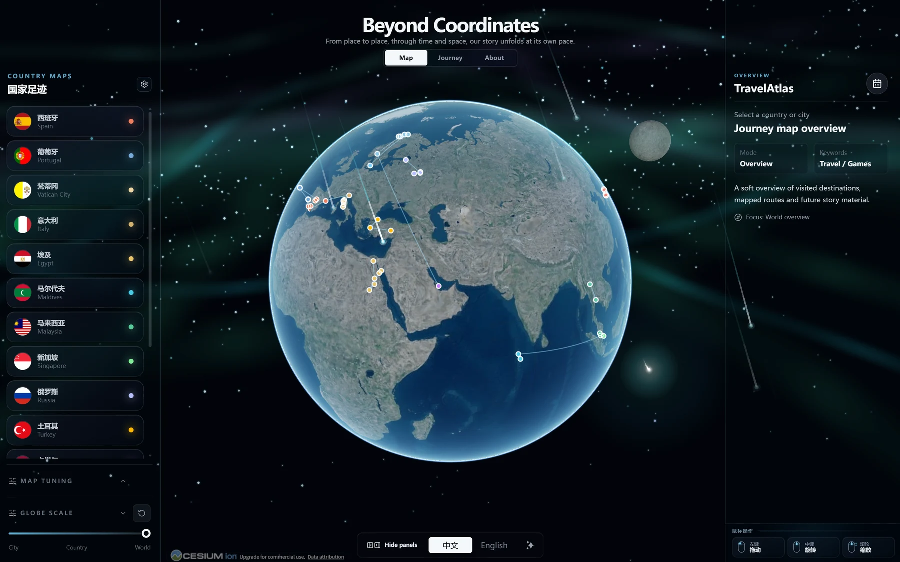
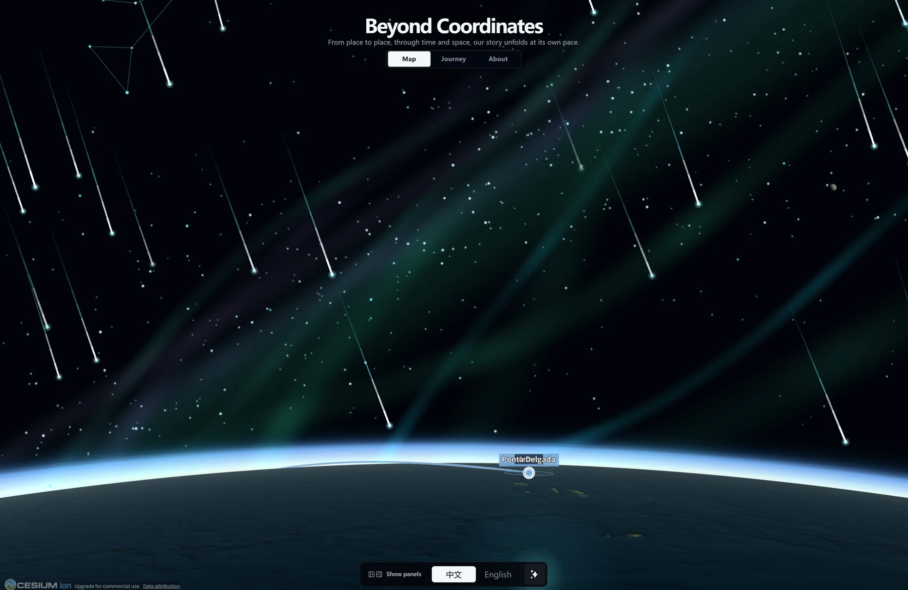
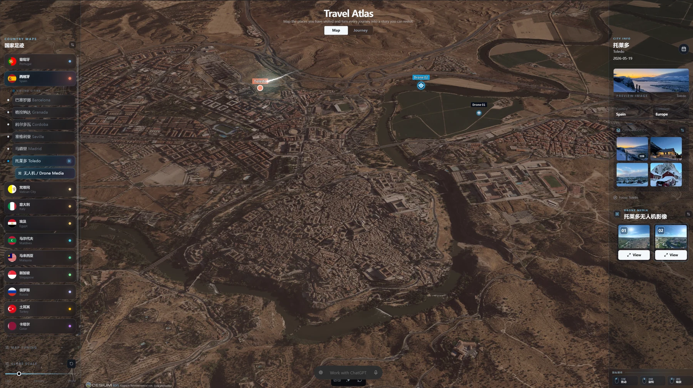
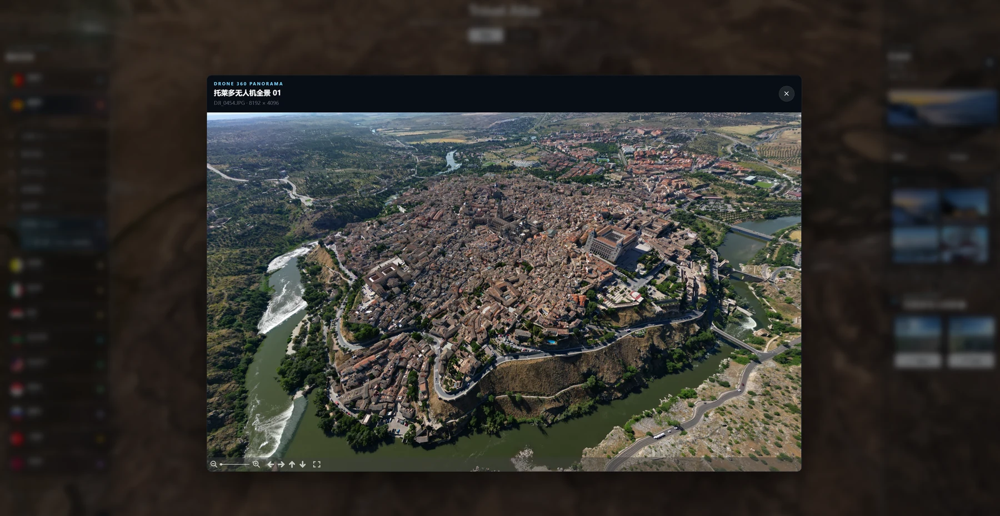

## 为什么写这个项目

旅行照片的问题从来不是"没有照片"，而是**照片和地点是脱节的**。

几千张照片躺在相册里，我知道自己拍过雪山、海和城市夜景，但"哪一年去的、从哪飞到哪、那天站在哪个坐标上按的快门"，只能靠回忆。航拍素材更麻烦：一张全景图丢进相册，就再也不是"某座城市上空的 360°"了。

所以我想做一个自己的旅行地图：**打开就是一颗地球，点一下某个国家，镜头飞过去，城市面板里就是那次旅行的照片和无人机影像。** 数据是我的，照片是我的，代码可以开源，但私人内容一个字都不进公开仓库。

顺便还想验证一件事：**一个星期，我只负责画方向，代码全部交给 AI（DSH）来写，一个完整的产品能做到什么程度。**



## 它长什么样

### 一颗真的能用的地球

地图主体是 Cesium。国家、城市、旅程路线都会画在地球上，可以一直拉近到地表，看每一处地形和影像瓦片的细节。

界面走的是玻璃拟态：Map 与 Journey 两个主视图、左右侧栏可以收起、底部一个图标 dock 管着图源切换、流星雨和版本更新。

<!-- TODO 配图：Map 视图全屏 + 左侧国家列表 + 右侧城市信息卡

-->

### 从银河一直看到地面

这是我最喜欢的一部分：镜头拉远，地球外面是作者绘制的星空与银河层；**在夜空模式下点击"流星雨"按钮，会有一次三秒左右的密集流星划过，带真实轨迹、发光头部和渐隐尾巴。** 鼠标快速移动时，指针后面还会拖一条方向相关的彗尾（在系统开启"减少动态效果"时会自动消失）。



日夜切换只影响地心固定的天体层：切到白天，星空干净地消失，地球本身不挪位置。

### 城市里的拍摄位置，精确到坐标与高度

打开城市面板，可以按坐标和海拔定位这座城市里的照片与无人机素材。城市照片是横图竖图都能完整适配的大图相册，无人机素材则分成两类：普通航拍照片走 contain 适配的高清大图，360° 全景走沉浸式球形 Viewer，缩略图上带一个 `360°` 角标，不会认错。





### Journey 视图

Map 是"空间"，Journey 是"时间"：按年份排列的旅行卡片加一条时间轴，点哪一年就回到那一年的行程上。

<!-- TODO 配图：Journey 视图的年份卡片与时间轴

-->

### 一个只存在于本机的编辑器

开发模式下会多出一整套编辑控件：新增和排序国家、城市，隐藏或恢复条目，选照片封面，管理城市照片与无人机媒体。

几个我觉得比"能编辑"更重要的细节：

- **国家不做手填。** 中/英/ISO 三位一体的自动补全，选定之后规范名称、代码、国旗和地图中心点都由结构化国家目录推导出来，不给人打错字的机会。
- **城市检索是显式动作。** 先选国家，输入城市名，自己按"检索"：配置了 Cesium ion 就先查 ion，不可用时回退到按国家过滤的 OpenStreetMap Nominatim 查询（单次 9 秒上限、请求串行、界面标注来源）；两条路都不行，就手填经纬度。
- **日期永远是用户填的。** 编辑器可以猜坐标、可以猜名字，但不猜日期。
- **隐藏是非破坏性的。** "撤销本轮"只把这次未保存的排序和隐藏改动还原，"恢复隐藏项"才真正清掉已保存的隐藏标记——两者都不会删除源记录。
- **生产构建里没有这些控件，也没有写入接口。** 不是用 CSS 把按钮藏起来，是构建产物里根本没有这套服务端能力。

:::tip
公开预览（`npm run dev:public`）跑的是仓库里中性的北大西洋示例数据，看不到任何个人内容，也不需要任何凭据。你 clone 下来就能启动。
:::

### 无人机素材：先读文件，再问人

选择无人机文件后，StarMap 会立刻用 `exifr` 逐个读取 EXIF/XMP：日期、GPS 坐标、绝对海拔、相对高度、相机型号。

**文件里已经有的值直接锁定为只读，只有读不到的字段才开放填写。** 日期必填；坐标和高度可以留空——留空的素材照样进 Drone Media，但不会在地球上生成标记，也不会把镜头拽过去。

### 媒体入库：原图永远不动

个人照片走一条三级管线：

```
MediaInbox 原图（不可变，不改写、不重命名、不删除）
        ↓  npm run media:check   （只读预检：国家、城市、格式、无人机元数据是否齐全）
        ↓  npm run media:import  （真正的导入）
 缩略图 640px WebP（城市卡片 / 侧栏用）
 预览图 2400px WebP（大图查看用）
 原始文件（只在你显式点开时才请求）
```

三份文件都用稳定的 hash 路径存放，原图始终保留一份，全部落在被 Git 忽略的本地用户库里。入海口只有一个：**源文件必须先在 Inbox 里，Agent 唯一能写的只有 `country.json` 和城市级 `media.json` 两个旁车文件。**

### 应用内更新中心

底部右侧的版本按钮最多每 12 小时查一次 GitHub Release。有新版本就亮呼吸灯，更新页里是更新指南、Release 公告和 Markdown 渲染的版本说明，还有一段可以复制给 AI 的安全更新指令。

**网站永远不会自动覆盖你的代码。** 更新按钮还是个反选控件：第一次点击进更新页，再点一次回到刚才那个 Map 或 Journey 页面。

## 三个我觉得最值得讲的设计

### 一、一套代码，两种运行配置

很多"开源模板 + 个人站点"的结局是分叉成两个仓库，然后其中一个永远烂掉。StarMap 只有一套代码、一套数据模型，靠两个显式 profile 分开：

| 命令 | 加载什么 | 编辑器 |
| --- | --- | --- |
| `dev:public` / `build:public` | 只加载 Git 跟踪的中性示例 `travel-map.sample.json` | 不存在 |
| `dev:personal` / `build:personal` | 加载外置私有层的配置、旅行记录与媒体 | 有，仅限本机 |

公共模式**从不自动发现个人数据**——哪怕私有层就在旁边，它也不会看一眼。每个 clone 这个项目的人都拿到同样的本地编辑能力，编辑能力不是原作者的特权，也不依赖任何在线 AI 服务。

### 二、私人数据在物理上不在 Git 仓库里

这是我这次最认真对待的一件事。`.gitignore` 只是第二道保险，**真正的边界是个人内容从一开始就不属于这个 Git 工作区**：

```text
StarMap/                  ← Git 仓库
├── 01_Web/               ← React + Cesium 应用（公开）
├── 02_Assets/MediaInbox/ ← 中性模板与 Schema（公开）
├── 03_Reference/         ← 隐私边界与媒体协议文档（公开）
└── 06_private/           ← 配置、旅行数据、原图、生成媒体（不在 Git 里）
    ├── config/.env.local
    ├── data/travel-map.local.json
    ├── data/editor-state.local.json
    └── MediaInbox/<真实国家>/
```

独立下载的用户可以用 `STARMAP_PRIVATE_ROOT` 把私有层指到任意目录。本地编辑接口只在 Vite 的 `serve` 阶段临时注册，路径是 `/__travelatlas/editor/*`，只接受本机同源请求；公开构建不携带这套能力。

### 三、发布前门禁：不是承诺，是机制

比"我很小心"更可靠的是一段能跑的命令。`npm run privacy:check` 会审计当前 Git 跟踪清单（有没有把 `06_private/`、`MediaInbox` 真文件、`*.local.json`、`.env` 之类的东西放进仓库）、校验 `.gitignore` 里那几条关键规则还在、确认示例数据的 `privacy_level` 仍是 `public-sample`，并且检查 `droneMedia.ts` 里没有偷偷内置个人媒体。

`npm run release:check` 更狠：它要求工作区干净，**只把 Git 已跟踪文件归档到系统临时目录**，然后在这个根本看不到私有层的洁净环境里重新 `npm ci`、lint 和公共构建。

——这一步的意义是：它从机制上证明"私人内容无法混进公开发布"，而不是靠作者记得检查。

:::warning
两件必须说清楚的事：

1. **在线图源凭据在浏览器端必然可见。** 把 token 排除出 Git 只防止仓库泄露，不防止访客看到。所以正式部署要单独申请生产凭据，并限制允许域名与资源范围。
2. **不要把完整 token 贴进任何对话、Issue、截图或日志。** StarMap 的规则文件里对此写得很死：只告诉你怎么在外置私有层里填，只检查"变量是否存在"和地图实际是否加载，从不读回凭据内容。
:::

## 让 AI 写这一周

**分工是这样的：我画方向，DSH 把它变成代码。**

我负责的部分：要什么、不要什么，隐私边界画在哪，"哪些东西绝对不能进 Git"，界面和交互的取舍，以及每次改完之后验收。DSH 负责的部分：Cesium 地球与天体层、编辑器中间件、媒体导入管线、脚本、文档和发布说明——一周里版本走到了 0.3.1。

:::tip
我用的工具是 **DSH（DeepSeek Harness）**，开发周期一周。这个项目里几乎每一行代码都是它写的，我一行行读得不多——但我把"读代码"的力气花在了"写规则"上。
:::

真正让这件事跑起来的东西不是提示词，而是仓库里的 `AGENTS.md`。项目根目录和 `01_Web/` 各有一份规则文件，写清楚：先读哪些文档、地图的主实现是 `CesiumAtlasGlobe.tsx`（旧的 react-globe 实现冻结为 legacy，不许动）、预览只能用 `npm run dev:personal`、不许用 `--host 0.0.0.0`、不许反复起 dev server、端口固定（Codex 用 5173，DSH 用 5174，被占用就停下报告而不是自动换端口）、媒体导入必须先问后做、凭据永不读回。

**一周里 AI 也确实犯了不少错**，`v0.2.0` 到 `v0.3.1` 的修复列表基本就是一份"AI 写出来的坑"清单：

- 新生成的缩略图请求被开发服务器返回成了应用页面，缩略图全是空的；
- Windows 正在写媒体文件时，本地预览服务会意外中断；
- 隐藏过的媒体重新导入后"消失了"（因为同一个媒体 ID 还带着隐藏标记）；
- 彻底删除要重复点好几次才生效；
- 编辑器刷新后视角被重置回初始地球，而不是停在你刚才看的城市；
- 繁简体变体和拉丁重音的城市名搜不到（比如 `São Miguel`）。

修这些问题的过程，其实就是在给 `AGENTS.md` 补规则的过程。我最大的感受是：**AI 能写代码，但边界必须由人来定。画方向不是提需求，是划红线。**

## 技术选型

| 层次 | 选型 | 说明 |
| --- | --- | --- |
| 框架 | React 19 + TypeScript | 单页应用，Vite 8 |
| 3D 引擎 | Cesium 1.142 + resium | 地球、地形、影像瓦片、相机导航 |
| 天体层 | Cesium 原生 Primitive / PointPrimitive / Polyline | 自绘星空、银河与流星轨迹 |
| 全景 | photo-sphere-viewer 5 | 无人机 360° Viewer |
| 元数据 | exifr | 前端直接读 EXIF/XMP |
| 图像处理 | sharp（脚本侧） | 640 / 2400 两级 WebP 派生 |
| 样式 | Tailwind CSS v4 | 玻璃拟态界面 |
| 国家目录 | world-countries（ODbL） | 仅开发中间件使用，不进公开客户端包 |
| 图源 | Cesium ion / 天地图 / 内置 Natural Earth II | 无凭据也能启动，低清兜底 |
| 旧实现 | react-globe.gl | 冻结保留，仅作回滚参考 |

选型上唯一刻意"留后路"的地方是图源：**不配 token 也能跑。** 没凭据时用内置的低清 Natural Earth II 底图启动，地图底部的图源菜单永远列出三种选择，绿灯只代表"变量非空"，红灯代表这条在线图源还没配置。

## 怎么跑起来

需要 Git，和与 Vite 8 兼容的当前 Node.js LTS 版本。

```powershell
git clone https://github.com/Aisland-SJL/StarMap.git
cd StarMap/01_Web
npm ci
npm run dev:public
```

打开 `http://127.0.0.1:5173/`，这是纯公共预览，只有中性示例数据，不需要任何凭据。

要用自己的地图，就在源码仓库**外面**建一个私有层（官方工作区固定为 `StarMap/06_private/`），把 `.env.example` 复制成 `<private-root>/config/.env.local`，填好 token，然后：

```powershell
npm run dev:personal
npm run privacy:check
npm run build:public
```

::github{repo="Aisland-SJL/StarMap"}

## 后续计划

- [ ] 让 Journey 视图的时间轴更完整，覆盖没有照片只有足迹的年份
- [ ] 媒体导入支持更多原始格式（现在是 jpg / jpeg / png / webp / avif，其他格式需要单独转换步骤）
- [ ] 城市检索的失败反馈再细一点，让"该改用手填坐标"这件事更明显
- [ ] 补一批中性的示例媒体，让 clone 下来的人不用自己准备素材就能看到完整效果
- [ ] 把 `03_Reference/` 里的媒体导入协议再写细一点，让别的 Agent 接手时不用猜

## 结语

一周时间，一个我只负责"画方向"的项目，最后能跑成这样，说实话超出了我一开始的预期。

但这次真正的收获不是"AI 写代码有多快"，而是**当一个项目的数据里天然带着隐私属性时，你必须先把边界设计出来，再让它写代码**：哪个目录不在 Git 里、哪些接口只在开发模式存在、哪些字段永远只能用户填、发布前用哪条命令证明私人内容进不来。这些决定 AI 不会替你做——它只会非常忠实地实现你画的那条线。

代码和文档都在仓库里，欢迎拿去改成你自己的旅行地图。